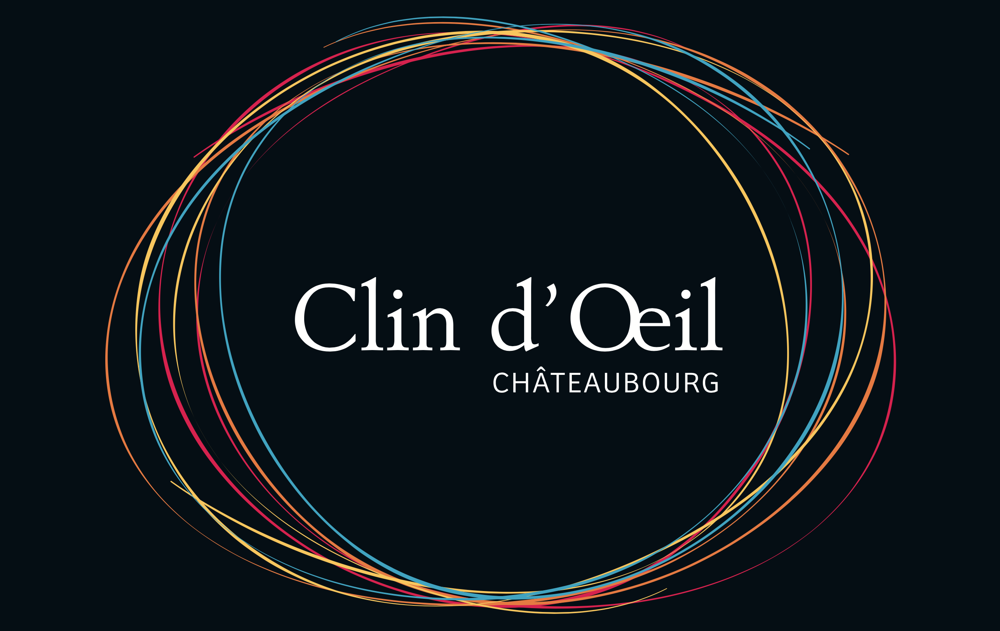
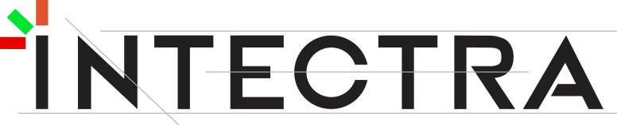
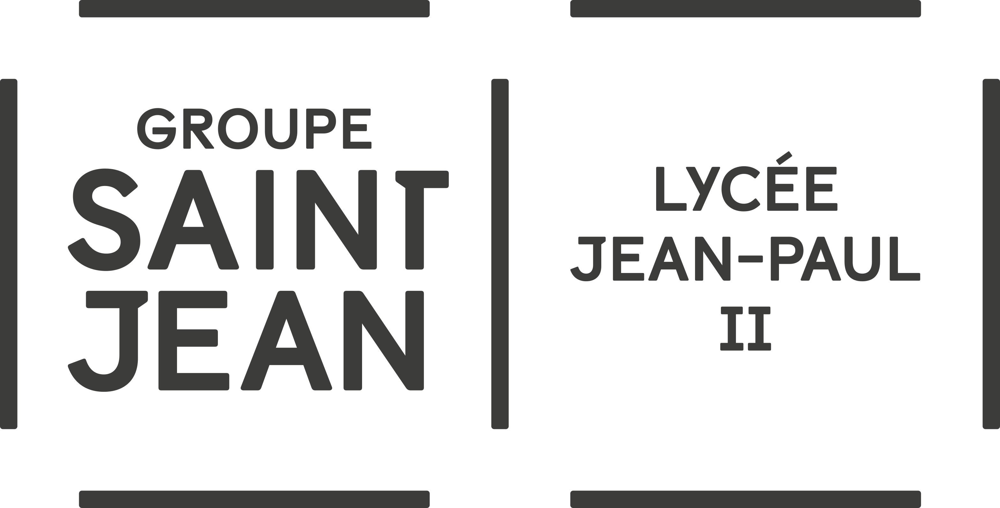

## Les partenaires solidaires du 4L trophy

### Enfants du désert

[Enfants du désert](https://enfantsdudesert.org) est une association humanitaire française créée en 2005, opérant au Maroc ainsi qu’en Argentine. 

D’abord centrée sur l’accès à l’éducation des enfants du sud marocain, elle a ensuite élargi son champ d’intervention à la santé et aux conditions de vie des enfants, ainsi qu’à l’accompagnement des femmes du désert vers une autonomie financière et de vie.

16 associations locales collaborent avec Enfants du désert pour la mise en œuvre de projets. Le tissu économique et social local (artisans, commerçants) est impliqué le plus possible.

### La Croix-Rouge française

La [Croix-Rouge française](https://www.croix-rouge.fr) est une association reconnue d’utilité publique fondée en 1864 et qui se donne pour mission de *« protéger et relever sans condition les personnes en situation de vulnérabilité et construire, avec elles, leur résilience »*.

70.521 bénévoles font vivre l’association pour lutter contre les différentes formes de précarités, à travers des projets sur le territoire français et à l’étranger.

## Les entreprises qui nous font confiance

### Clin d'Œil à Chateaubourg

[Clin d'Œil](https://www.clindoeil-optique.fr) est un opticien indépendant présent à Châteaubourg depuis plus de 15 ans. Son équipe qui s'emploie chaque jour à donner le sourire à ses clients en leur proposant des lunettes de collections et/ou de créateurs selon leurs goûts et leur budget.

Clin d'Œil et son équipe se démarquent par des conseils personnalisés, un large choix de produits (montures, lentilles de contact, solaires) ainsi que des partenariats avec des fournisseurs reconnus.

Une expérience complète déjà testée et approuvée par notre pilote Pierre-Ange dont les yeux bénéficient du meilleur matériel adapté à sa vue pour affronter le désert marocain !

### Intectra

[Intectra](https://intectra.fr) est un chaudronnier basé à Servon-sur-Vilaine. L’entreprise intervient sur l’ensemble du territoire français mais aussi à l’international pour des projets de :\
• Métallerie et serrurerie\
• Chaudronnerie et tôlerie\
• Métallerie à façon\
• Projets industriels\
• Agencement et création

Intectra travaille sur des projets de domaines variés comme l’industrie automobile, aéronautique ou agroalimentaire, ainsi que l’aménagement et le mobilier contemporain.

L’équipe de Stéphane Vennin s’est occupée de la réalisation d’une plaque de protection renforcée pour le dessous de notre voiture, équipement obligatoire pour le raid du 4L Trophy. Un grand merci à eux !

### Lycée Jean-Paul II à Saint-Grégoire

Le [lycée Jean-Paul II](https://www.lycee-jeanpaul2.fr) de Saint-Grégoire fait partie du Groupe Saint-Jean, qui rassemble quatre autres établissements, pour une couverture globale de la 6e au bac+5 : le collègue Immaculée (Saint-Grégoire), par lequel nous sommes aussi passés, le lycée de La Salle (Rennes), Pôle Sup et CFA de La Salle (Rennes).

Suite à l'intervention de Pierre-Ange auprès des élèves fin décembre, ces derniers ont vraiment joué le jeu et nous ont permis de récolter tout le matériel scolaire nécessaire pour la redistribution à Enfants du désert. Un grand merci à eux ainsi qu'à Jonas Lauer, responsable éducatif du lycée, pour la coordination de cette intervention !

## Nos généreux donateurs particuliers

Un grand merci à toutes et tous pour votre contribution !

Alice E., Amélie T., Anne G., Anne P., Benoît G., Charline C., Clément P., Donovan N., Florian R., Isabelle J., Julia D., Juliette B., Jean-Louis T., Laëtitia D., Louise J., Lou-Ann M., Lucie P., Maëlis S., Mathilde R., Matthieu D., Maxime C., Quentin L., Pauline D., Pauline R., Philippe D., Pierre L.G., Yannick G., Yannick R, Victor D.B. 