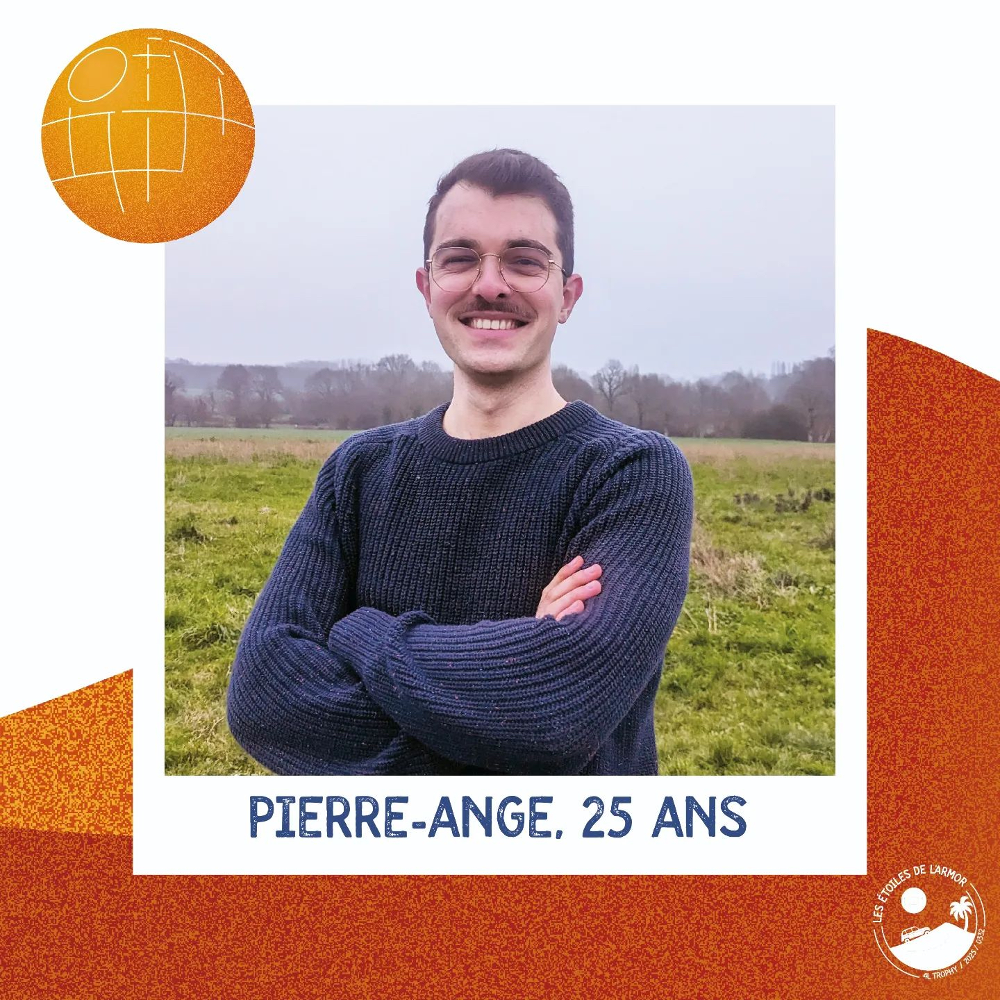
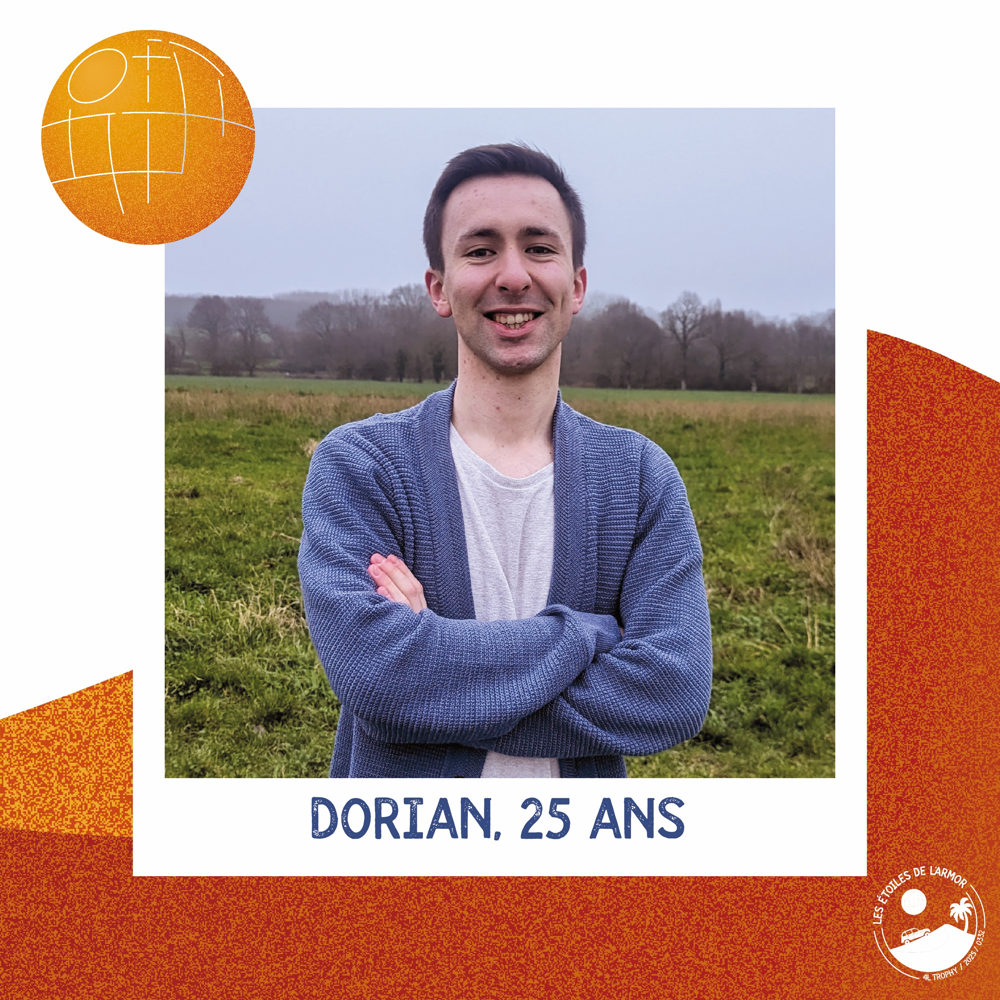

 Téléchargez notre dossier de sponsoring.

## Pierre-Ange Tirel

26 ans · Doctorant

Passionné de bières 🍺 et de rallye, je suis ici pour lier l'utile à l’agréable 😉. Pourquoi bricoler des voitures sans but alors que l’on peut aider les enfants du désert ?

Plus sérieusement, c’est l’occasion pour moi de découvrir le monde de la mécanique et la gestion d’un projet de grande ampleur 🤓. C’est la première fois que je m’engage dans une mission humanitaire, j’ai hâte de voir où tout cela va nous mener. Novice en mécanique (pour l’instant 🧐), cela fait un bon moment que je réfléchis à retaper une vieille voiture. Le faire tout en facilitant l’accès à l’éducation et au sport des enfants, c’est un combo gagnant ! 

Le côté gestion est aussi intéressant, les sponsors, la cagnotte, l’organisation, la communication, un condensé de challenges !

## Dorian Girard
26 ans · Journaliste

🕺 J'aime les comédies musicales, les fondants au chocolat et sortir des refs de tout et n'importe quoi !

🏎️ Passionné de sports mécaniques depuis l’enfance et pilote moto amateur pendant huit ans, le @4l_trophy est un peu ma madeleine de Proust : odeur d’huile, cambouis, essence et rugissement des moteurs.

🫡 Si mon âme de compétiteur et d’amateur de défis sont toujours dans les parages, je les mettrai cette fois-ci au service d’un projet solidaire avant tout !

🇲🇦 Pour moi, repartir sur un projet de A à Z, découvrir le Maroc et sortir de ma zone de confort au profit des @enfantsdudesert est particulièrement excitant !

