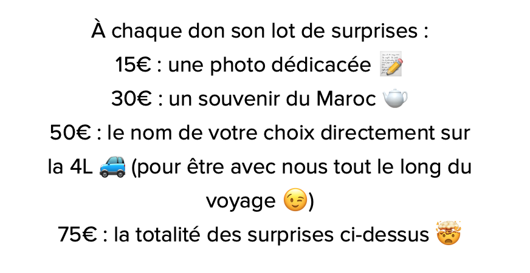

Chaque don peut être matériel ou non, grand ou petit, physique ou de services, peu importe, tous auront la même fonction : nous faire avancer ensemble vers cette aventure qu’est le 4L Trophy ! N'hésitez pas à nous contacter sur lesetoilesdelarmor@gmail.com si vous êtes intéressés ou pour tout autre renseignement !

## Le Parrainage
Le principe est simple : vous donnez, nous donnons. Envie d’attirer de la clientèle ? Un encart publicitaire vous est réservé sur la 4L. Envie d’animation ou de taper dans l'œil du public ? La 4L se déplace pour vous. D’autres envies vous viennent ? Nous sommes à votre disposition pour construire un partenariat solide.

## Le Don
Un soutien matériel ou financier réalisé à titre particulier qui vous donne le droit à des contreparties que nous  avons choisies pour vous (photo, souvenir du maroc, nom inscrit sur la 4L, etc).

Nous avons mis en place une [cagnotte](https://lydia-app.com/pots?id=27778-4l-trophy-2025-332) afin de faciliter la récolte des dons particuliers.

